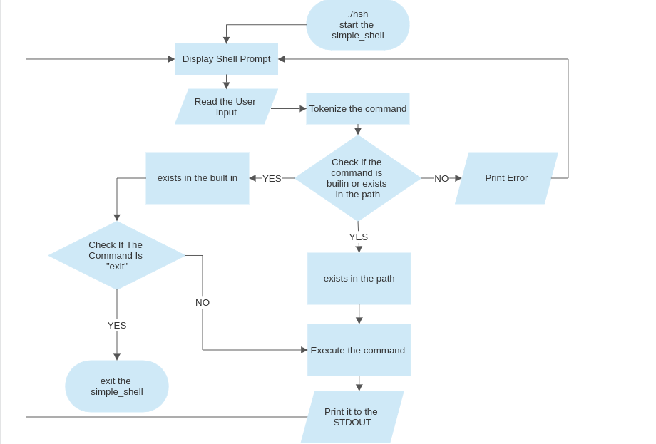

# [Simple_Shell](https://github.com/RyuzakiiL23/simple_shell/tree/main)

🐚 Welcome to Our Simple_Shell. We [Hatim](https://github.com/Hatimsel) and [Omar](https://github.com/RyuzakiiL23) recently completed a lightweight and efficient command-line shell program built with the C programming language! 💻

## Overview 📝

🖥️ Simple Shell provides a user-friendly interface for executing commands and managing your system. It is a restricted shell that adheres to the list of allowed functions and system calls provided below. With simplicity and efficiency in mind, Simple Shell offers a reliable shell experience while utilizing only the allowed functions and system calls.

## Features ✨

⚡️ Simple Shell comes with the following features:

- Command execution: Enter commands and execute them seamlessly.
- Command-line arguments: Pass arguments to executables for enhanced functionality.
- Environment variable management: Easily manage environment variables for your shell sessions.
- "exit" command: Use the "exit" command to gracefully exit the shell.

## Dependencies 📦

🔧 Simple Shell has the following dependencies:

- `main.h`: Header file containing function prototypes and necessary library includes.
- `main.c` : Function serves as the entry point for the program. It continuously reads user input, tokenizes it, and executes the corresponding command using the aforementioned functions. The shell provides a prompt ($) to indicate readiness for user commands.
- `functions.c` : The file that hold the functions that will be called in the `main.c`.
- `str.c strr.c` : Files containing function definition for our own forbiden functions and system calls(strcat, strlen, ...).
-
## Functionality 🔍

⚙️ Simple Shell leverages several functions to provide its functionality:

- `env`: Duplicates the environment variables, ensuring seamless management.
- `freeEnviron`: Frees the duplicated environment variables, preventing memory leaks.
- `removeTrailingNewline`: Removes trailing newline characters, ensuring clean input handling.
- `tokenizeCommandLine`: Tokenizes command lines into individual arguments for accurate execution.
- `executeCommand`: Executes commands with the given arguments for efficient processing.
- `performFork`: Performs a fork to create child processes and execute commands within them.

The `main` function serves as the entry point for the program. It continuously reads user input, tokenizes it, and executes the corresponding command using the aforementioned functions. The shell provides a prompt (`$`) to indicate readiness for user commands.

## Flowchart 📋

⚙️ Here a flow chart that illustrate, in an easy way, how the our [Simple_Shell](https://github.com/RyuzakiiL23/simple_shell/tree/main) works:



## How to Try It Locally 🚀

📋 To get started with Simple Shell, follow these steps:

1. Clone the repository and navigate to the project directory.

```
git clone https://github.com/RyuzakiiL23/simple_shell.git
cd simple_shell
```

2. Compile the program.

```
gcc -Wall -Werror -Wextra -pedantic -std=gnu89 *.c -o hsh
```

3. Run the shell.

```
./hsh
```

4. Once the shell is running, you can start entering commands and executing them.

```
$ ls
file1.txt  file2.txt  folder1  folder2
```

5. Enjoy the power and convenience of Simple Shell! Feel free to explore various commands and features.

6. To exit the shell, simply use the "exit" command.

```
$ exit
```

## Contributing 🤝

🌟 Contributions to this project are greatly appreciated. If you find any issues or have ideas for new features, feel free to submit a pull request. We welcome collaboration and value your input!

## Contributors 👥

This project is a collaboration between:

- [EL HAMRANI Omar](https://github.com/RyuzakiiL23)
- [SELMUN Hatim](https://github.com/Hatimsel)

🎉 We are grateful make it that far and bringing our own Simple_Shell to life 😊!
